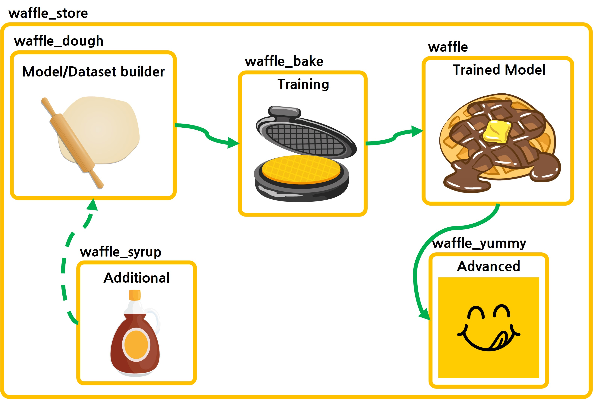

# Waffle Blueprint
- Waffle은 기존의 tx_model의 소스코드를 재활용하여 개발상의 문제를 해결하기 위한 프로젝트 입니다.
- 연구자들에게는 편리한 연구 플랫폼을 TX 개발자에게는 독립적인 학습 플랫폼을 제공합니다.
- 

# Components
## waffle_dough
- 개요
    - 모델 학습에 필요한 객체들을 build 합니다.
    - tcore_ingredient 로 생성한 모델 객체는 어디서든 사용 가능합니다.
- 구성요소
    - model builder
        - pytorch_lightning.LightningModule 을 상속받아 만든 pytorch model
    - dataset builder
        - 스누아이랩 data format convention 을 따르는 pytorch dataset
- 기술 스택
    - pytorch
    - pytorch lightning
    - pydra (pydantic + hydra)
## waffle_bake
- 개요
    - tcore_ingredient 를 import 하여 사용합니다.
    - 기본적인 training loop 및 logging 을 담당합니다.
- 구성요소
    - Trainer
        - pytorch_lightning.Trainer
    - Logger
        - mlflow, tensorboard, etc
- 기술 스택
    - pytorch
    - pytorch lightning
    - pydra (pydantic + hydra)
    - mlflow, tensorboard
## waffle_syrup
- 개요
    - tcore_ingredient 에서 import 하여 사용합니다.
    - 고도화된 기법들을 구현합니다.
- 구성요소
    - training_skills (이름 미정)
    - transforms (이름 미정)
- 기술 스택
    - pytorch
    - opencv, PIL
    - Albumentation
## waffle_yummy
- 개요
    - 학습된 모델을 사용하는 기법들을 구현합니다.
- 구성요소
    - data_selection
    - data_filter
    - feature_visualization
    - etc
- 기술 스택
    - pytorch
## waffle_store
- 개요
    - tcore 기능들을 배포합니다.
    - training 등의 프로세스를 관리합니다.
- 구성요소
    - REST API
        - tcore를 사용한 training 등의 기능을 REST API 형태로 제공합니다.
    - Docker build
        - tcore를 docker 형태로 배포합니다.
- 기술 스택
    - Docker
    - FastAPI
